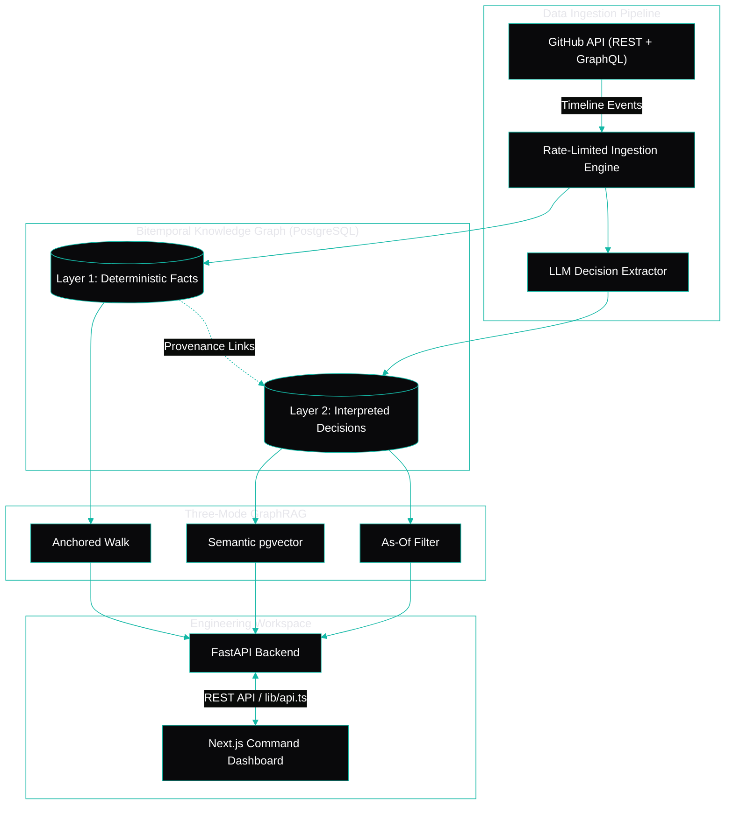
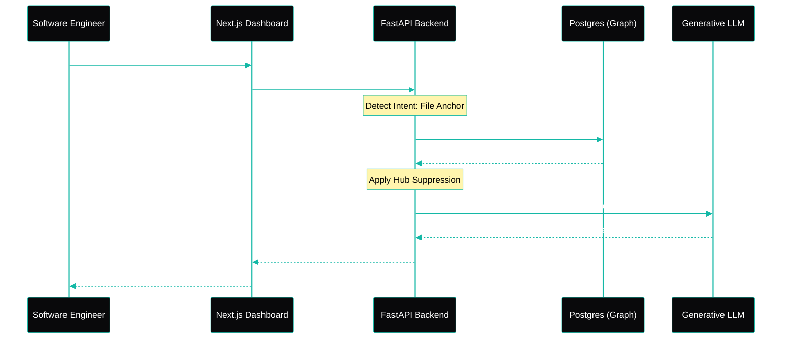

<div align="center">
  
  <h1>KAIRO</h1>
  <p><strong>A Temporal Knowledge Graph Based Engineering Intelligence Platform</strong></p>
  <p>
    
    
    
  </p>
</div>

## 📖 Background

Modern software engineering teams rely on distributed toolchains (GitHub, Jira, Slack, wikis) that efficiently track the **current state** of tasks but systematically fail to preserve the **reasoning** behind critical architectural decisions. Over time, the intended architecture diverges from the implemented codebase, and teams lose the ability to answer fundamental questions like *"Why does the auth layer use JWT?"* or *"What happens if we change this module?"*

Standard AI developer tools and Vector RAG (Retrieval-Augmented Generation) suffer from **Temporal Blindness**. They retrieve chunks based purely on semantic similarity, making it impossible to distinguish between an active architectural decision and a superseded one from years ago.

## 🎯 The Solution

**KAIRO** (Knowledge-graph Intelligence for Architectural Reasoning and Observability) is an AI-driven platform that reconstructs and preserves engineering memory. It ingests historical artifacts (commits, PRs, issues) and builds a bitemporal knowledge graph to answer deep architectural questions that simple search boxes cannot.

### Core Capabilities
- 🧠 **Architectural Extraction**: Leverages LLMs to extract definitive architectural decisions from unstructured developer discussions.
- ⏱️ **Bitemporal Graph Mapping**: Tracks both when KAIRO learned a fact (*Transaction Time*) and when the fact was actually true in the real world (*Valid Time*).
- 📉 **Decision Drift Index (DDI)**: A quantifiable metric that measures how far the current codebase has drifted from documented architectural decisions.
- 📊 **Engineering Evolution Score (EES)**: A longitudinal health metric for repositories based on delivery stability, ownership diversity, and drift.
- 🛡️ **Change Impact Scanner**: A pre-merge analytical tool that scans modified files and predicts architectural risk using historical telemetry.

---

## 🔒 The "X-Factor" Features

1. **Two-Layer "Trust-Isolated" Graph**
   To prevent AI hallucinations from infecting factual data, KAIRO strictly separates the graph:
   - **Layer 1 (Deterministic)**: 100% factual API data (Commits, PRs, Authors). Never wrong, zero LLM involvement.
   - **Layer 2 (Interpreted)**: LLM-extracted decisions carrying strict provenance (verbatim quotes) and confidence scores.

2. **Three-Mode GraphRAG Retrieval**
   KAIRO dynamically selects retrieval modes based on user intent:
   - *Anchored*: Walks the graph from a specific file to find structural dependencies sharing zero vocabulary with the prompt.
   - *As-Of*: Filters temporal intervals to answer historical queries (e.g., *"What did we believe in March 2023?"*).
   - *Semantic*: Fallback `pgvector` similarity search.

3. **Dynamic Hub Suppression**
   Unrestricted graph traversal in codebases suffers from *Hub Domination* (e.g., a sweeping refactor commit connecting 500 unrelated files). KAIRO implements mathematical degree-suppression, reducing result-set overlap from 56% to 27% and drastically improving LLM context quality.

---

## 🧠 System Architecture



## 🔄 User & Data Flow



---

## 🛠️ Technical Architecture & Stack

### Backend & Graph Engine
- **Core Engine:** Python 3.11+, FastAPI, Uvicorn
- **Database:** PostgreSQL 16 with `pgvector` extension
- **Graph Traversal:** Native SQL Recursive CTEs (Replaces Neo4j)
- **AI Integration:** OpenRouter / OpenAI-compatible API with content-hash caching (configured with `cohere/north-mini-code:free` or `openrouter/free`)

### Engineering Workspace (Frontend)
- **Framework:** Next.js 16 (App Router), React 19, TypeScript
- **Styling:** Tailwind CSS (Modern Light SaaS Aesthetic & Theme)
- **Interactive Tour:** Native Docked Onboarding Tour Guide (`OnboardingGuide.tsx`) with progress tracking
- **Icons:** Pure SVG brand lockup and Lucide icons

---

## 🧭 Application Routes

### Marketing & Feature Hub
- `/`: Column-based hero landing page with interactive portals and anchor navigation
- `/product`: Two-layer trust isolation architecture breakdown
- `/features/graphrag`: Three-Mode GraphRAG with SQL CTE traversal diagrams
- `/features/drift-index`: Decision Drift Index and Engineering Evolution Score
- `/features/impact-scanner`: Pre-merge blast radius and churn risk analyzer
- `/pricing`: Community Free, Team, and Enterprise pricing tiers with FAQ
- `/docs`: Documentation and architecture guide hub
- `/connect`: GitHub OAuth connection page

### Interactive Live Demo (`/demo`)
- `/demo`: Workspace Overview with DDI (72/100), EES (85), Sprint 42, and live activity
- `/demo/board`: ZenHub-inspired architecture-aware Sprint Kanban board with risk badges and Fibonacci Planning Poker
- `/demo/hierarchy`: Multi-level work hierarchy (Objectives -> Projects -> Epics -> Issues -> Sub-tasks) with automated progress rollups
- `/demo/ask`: Three-Mode GraphRAG query console with verified evidence citations
- `/demo/graph`: Temporal Knowledge Graph Explorer with hub suppression degree slider
- `/demo/impact`: Pre-merge Change Impact Scanner with churn table and mitigation checklist
- `/demo/settings`: Workspace and two-layer graph isolation settings

---

## 🚀 Setup & Installation

To run KAIRO, you can spin up the FastAPI backend and the Next.js frontend in separate terminal windows.

### 1. Terminal 1: Database & Python Backend
Ensure you have Python 3.11+ and Docker installed.

```bash
# Setup Database
docker-compose up -d
docker exec -i kairo-db psql -U kairo -d kairo < schema.sql

# Setup Virtual Environment
python -m venv .venv
.\.venv\Scripts\activate  # Windows

# Configure Environment (.env)
cp .env.example .env
# Set OPENAI_API_KEY in .env (OpenRouter key with cohere/north-mini-code:free)

# Install & Run
pip install -e .
uvicorn src.kairo.web:app --reload
```
*(The backend API will run on `http://localhost:8000`)*

### 2. Terminal 2: Next.js Frontend
Ensure you have Node.js 18+ installed.

```bash
cd frontend
npm install
npm run dev -p 3001
```
*(The Command Dashboard will be available at `http://localhost:3001`)*

---
*KAIRO does not just track work, it protects teams from repeating architectural mistakes.*
